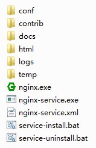

# nginx-service

Thie project provide a program that warpped nginx.exe as a Windows server by [winsw](https://github.com/kohsuke/winsw)

本项目提供了一个使用 [winsw](https://github.com/kohsuke/winsw) 将 nginx 包装为一个 Windows 服务的程序

## Usage / 使用方法

1. Clone or download this project / 克隆或者下载本项目
2. Copy all files in this project into nginx folder / 复制项目中所有文件到 nginx 文件夹中
3. Double-click `service-install.bat` to install and start the service / 双击 `service-install.bat` 文件以安装并启动服务

**The folder of nginx should looks like this / nginx 文件夹看起来应该如此:**

## Notice / 注意

**Need .NET Framework 4.0+**

You may configure the service via `nginx-service.xml` file, and see [this guide](https://github.com/kohsuke/winsw/blob/master/doc/xmlConfigFile.md) for more options.

**需要 .NET Framework 4.0+**

您可以通过 `nginx-service.xml` 文件来配置服务，请查阅 [该指引](https://github.com/kohsuke/winsw/blob/master/doc/xmlConfigFile.md) 了解更多选项。